# Data Platform - AI-Powered Contract Validation

Leveraging Claude AI to automatically validate producer code changes against data contracts, catching breaking changes before they reach production.

## The Problem

In modern microservices architectures with event-driven systems (Kafka, SQS, EventBridge), **upstream producers and downstream consumers are independently deployed**. This independence creates a critical challenge:

**How do you ensure upstream changes don't break downstream consumers?**

Even with well-defined data contracts, producers can accidentally introduce breaking changes:
- Adding enum values not in the contract
- Changing field names or types
- Using wrong units (seconds vs milliseconds, dollars vs cents)
- Violating business rules (negative quantities, out-of-range values)
- Leaking PII into wrong fields

### Traditional Solutions (and Their Limitations)

**1. Schema Registries (Confluent, AWS Glue)**
- ✅ Validates JSON/Avro schema syntax
- ❌ Misses semantic issues (unit mismatches, business logic errors)
- ❌ Can't detect field naming mistakes (both `amount` and `order_total` are valid)
- ❌ No understanding of code logic

**2. Integration Tests**
- ✅ Can catch some breaking changes
- ❌ Expensive to maintain
- ❌ Slow feedback loop
- ❌ Often skipped for "minor" changes
- ❌ Requires running full producer + consumer stack

**3. Manual Code Reviews**
- ✅ Can catch issues if reviewer knows the contract
- ❌ Doesn't scale across teams
- ❌ Human error prone
- ❌ Reviewers may not have contract context
- ❌ Slows down development

**4. Contract Testing (Pact, Spring Cloud Contract)**
- ✅ Tests producer-consumer interactions
- ❌ Requires maintaining test code
- ❌ Only validates what you explicitly test
- ❌ Can drift from actual contracts

## Why AI-Powered Validation?

**Claude AI excels at understanding semantic meaning and business logic**, making it perfect for contract validation:

✅ **Semantic Understanding**: Detects that `getEpochSecond()` produces seconds, not the required milliseconds
✅ **Business Logic Analysis**: Understands that `quantity = 0` violates a "must be positive" rule
✅ **Context Awareness**: Knows `orderTotal` (camelCase) maps to `order_total` (snake_case), but `amount` doesn't
✅ **Code Reasoning**: Traces through switch statements and builders to find the actual output
✅ **Instant Feedback**: Runs in seconds on every PR, no test infrastructure needed
✅ **Zero Maintenance**: No test code to write or maintain

**This POC demonstrates how to use Claude Code Action to automatically validate producer changes against data contracts on every pull request.**

## Architecture

```mermaid
graph TB
    subgraph Producer["🏢 Producer Repository"]
        PR[👨‍💻 Developer<br/>Creates PR]
    end

    subgraph Trigger["⚡ Event Pipeline"]
        GHA[📱 GitHub App<br/>Webhook]
        WH[🔗 Webhook Handler]
        API[📡 Repository Dispatch<br/>API Call]
    end

    subgraph Platform["🏛️ Data Platform Repository"]
        WF[⚙️ Validation Workflow<br/>GitHub Actions]
        subgraph Analysis["🤖 AI Analysis"]
            Claude[🧠 Claude Code Action<br/>Semantic Validation]
        end
    end

    subgraph Result["✅ Feedback"]
        Comment[💬 PR Comment<br/>with Results]
    end

    PR --> GHA
    GHA --> WH
    WH --> API
    API --> WF
    WF --> Claude
    Claude --> Comment
    Comment -.feedback.-> PR

    style PR fill:#e3f2fd,stroke:#1976d2,stroke-width:3px
    style GHA fill:#fff3e0,stroke:#f57c00,stroke-width:2px
    style WH fill:#fff3e0,stroke:#f57c00,stroke-width:2px
    style API fill:#fff3e0,stroke:#f57c00,stroke-width:2px
    style WF fill:#f3e5f5,stroke:#7b1fa2,stroke-width:2px
    style Claude fill:#fff9c4,stroke:#f9a825,stroke-width:3px
    style Comment fill:#c8e6c9,stroke:#388e3c,stroke-width:3px

    style Producer fill:#e8eaf6,stroke:#3f51b5,stroke-width:2px
    style Trigger fill:#fff8e1,stroke:#ffa000,stroke-width:2px
    style Platform fill:#f1f8e9,stroke:#689f38,stroke-width:2px
    style Analysis fill:#fffde7,stroke:#fbc02d,stroke-width:2px
    style Result fill:#e0f2f1,stroke:#00897b,stroke-width:2px
```



### How It Works

**For producer teams, setup is simple: just install the GitHub App.** Validation runs automatically on every pull request.

**Flow:**

```mermaid
sequenceDiagram
    actor Dev as 👨‍💻 Developer
    participant PR as 📝 Pull Request
    participant GHA as 📱 GitHub App
    participant WH as 🔗 Webhook Handler
    participant API as 📡 Repository Dispatch
    participant WF as ⚙️ Validation Workflow
    participant Claude as 🧠 Claude Code Action

    Dev->>PR: Creates PR in producer repo
    PR->>GHA: Triggers webhook event
    GHA->>WH: Sends pull_request payload
    WH->>API: Calls repository_dispatch API
    API->>WF: Triggers validation workflow

    Note over WF: Checks out contracts & PR code

    WF->>Claude: Invokes with validation prompt

    Note over Claude: Reads contract YAML<br/>Analyzes producer code<br/>Detects issues

    Claude-->>WF: Returns validation results
    WF->>PR: Posts comment with results
    PR-->>Dev: Shows validation feedback
```



**No test code to write. No CI/CD changes. Just install the app and get instant validation on every PR.**

### Key Components

**1. GitHub App**
- Installed on producer repos
- Receives webhook events on PR open/update
- Provides cross-repo access via scoped tokens

**2. Webhook Handler**
- Receives `pull_request` events from producer repos
- Calls GitHub API `repository_dispatch` to trigger contract validation workflow
- Passes PR metadata (repo, number, branch ref)

**3. Validation Workflow**
- Triggered by `repository_dispatch` event
- Checks out both platform repo (contracts) and producer repo (PR branch)
- Invokes Claude Code Action with validation prompt
- Posts results as PR comment

**4. Claude Code Action**
- Reads contract YAML from platform repo
- Analyzes Java/Kotlin code from producer PR
- Performs semantic validation
- Generates formatted report with breaking changes, warnings, or pass status

## Repository Structure

```
data-platform/
├── contracts/                    # Data contract definitions
│   ├── orders.yaml              # Order events contract
│   └── line-items.yaml          # Line item events contract
├── contract-mappings.yaml        # Maps producer repos to contracts
└── .github/workflows/
    └── validate-contracts.yml   # Main validation workflow
```

## Validation Categories

**P0 - BREAKING (🚨)**
- Enum drift, field removal/rename, type changes
- Unit mismatches, business rule violations

**P1 - WARNING (⚠️)**
- Default/null changes that don't break existing consumers

**P2 - WARNING (⚠️)**
- PII leakage in metadata fields

## Data Contract Specification

Contracts use [Data Contract Specification](https://datacontract.com/) format:

```yaml
dataContractSpecification: 1.0.0
id: orders
info:
  title: Orders
  version: 1.0.0
  owner: Data Platform Team

servers:
  production:
    type: kafka
    topic: orders
    format: json

models:
  orders:
    fields:
      order_id:
        type: text
        required: true
        unique: true

      order_status:
        type: text
        required: true
        enum: [PENDING, CONFIRMED, SHIPPED, DELIVERED, CANCELLED]
        enum_evolution: strict  # No new values without contract update

      order_total:
        type: long
        description: Total order amount in cents
        required: true
        quality:
          - type: range
            min: 1000
            max: 49900
```

## Example Validation Results

### Breaking Change Detected
```markdown
## 🔍 Contract Validation Results

**Status**: 🚨 BREAKING

### Critical Issues

#### 🔴 Field Rename
- **Field**: `order_total`
- **Problem**: Field renamed from `order_total` to `amount`
- **Location**: OrderProducer.java:62, :130
- **Fix**: Change field name back to `orderTotal` or update contract first
```

### Pass
```markdown
## 🔍 Contract Validation Results

**Status**: ✅ PASS

No breaking changes detected.
```

## Setup

### Required Secrets
- `ANTHROPIC_API_KEY`: Claude API key
- `GH_APP_ID`: GitHub App ID
- `GH_APP_PRIVATE_KEY`: GitHub App private key

### Related Repositories
- **Producer**: [checkout-service](https://github.com/vibe-coding-in-action/checkout-service)
- **Webhook Handler**: [contract-webhook-handler](https://github.com/zhiyuan91/contract-webhook-handler)
- **Platform**: [data-platform](https://github.com/zhiyuan91/data-platform) (this repo)
